# API REST Segura 2

## Nombre del Proyecto
Gestión de Tareas del Hogar

## Descripción del Proyecto
Esta API REST servirá como para una aplicación de gestión de tareas del hogar. Permitirá a los usuarios autenticarse, gestionar sus tareas y administrarlas según su rol, ya que podrán ser users o admins.

### Documentos y sus Campos

1. **Usuario**

   - `id`: Identificador único del usuario
   - `nombre`: Nombre del usuario
   - `email`: Correo electrónico (único)
   - `password`: Contraseña cifrada
   - `rol`: Tipo de usuario ("usuario" o "admin")

2. **Dirección**

    - `calle` : Nombre de la calle
    - `num` : Número del portal
    - `cp` : Código Postal
    - `ciudad` : Nombre de la ciudad

2. **Tarea**

   - `id`: Identificador único de la tarea
   - `titulo`: Breve descripción de la tarea
   - `descripcion`: Detalle de la tarea
   - `estado`: Estado de la tarea ("pendiente" o "hecha")
   - `usuarioId`: ID del usuario al que está asignada la tarea
   - `fecha_creacion`: Fecha de creación de la tarea

---

## Endpoints de la API

### **Autenticación**

1. **Registro de usuario** (`POST /registro`)
   - Permite registrar un nuevo usuario en la aplicación.
   - Recibe nombre, email, y contraseña.
   - Devuelve un token JWT.

2. **Login de usuario** (`POST /login`)
   - Permite a los usuarios iniciar sesión.
   - Recibe email y contraseña.
   - Devuelve un token JWT.

---

### **Gestión de Tareas**

3. **Obtener todas las tareas del usuario** (`GET /tareas`)
   - Devuelve todas las tareas asignadas a un usuario concreto.

4. **Crear una nueva tarea** (`POST /tareas`)
   - Un usuario puede crear una tarea para sí mismo.
   - Un administrador puede asignar tareas a cualquier usuario.

5. **Marcar tarea como hecha** (`PUT /tareas/{id}/hecha`)
   - Cambia el estado de la tarea a "hecha".
   - Un usuario solo puede cambiar el estado de sus propias tareas.
   - Un administrador puede cambiar el estado de cualquier tarea.

6. **Eliminar una tarea** (`DELETE /tareas/{id}`)
   - Un usuario solo puede eliminar sus propias tareas.
   - Un administrador puede eliminar cualquier tarea.

---

## Lógica de Negocio

- **Usuarios estándar** pueden:
  - Registrarse e iniciar sesión.
  - Ver sus propias tareas.
  - Marcar sus tareas como hechas.
  - Eliminar sus propias tareas.
  - Crear nuevas tareas para sí mismos.

- **Administradores** pueden:
  - Ver todas las tareas de cualquier usuario.
  - Crear tareas para cualquier usuario.
  - Marcar cualquier tarea como hecha.
  - Eliminar cualquier tarea.

---

### **Excepciones Definidas**

1. **Usuario no encontrado** (404 Not Found)
   - Se lanza cuando se intenta acceder a un usuario que no existe en la base de datos.

2. **Tarea no encontrada** (404 Not Found)
   - Se lanza cuando se intenta acceder a una tarea inexistente.

3. **Email ya registrado** (400 Bad Request)
   - Se lanza cuando un usuario intenta registrarse con un correo ya existente en la base de datos.

4. **Credenciales inválidas** (401 Unauthorized)
   - Se lanza cuando el usuario proporciona un email o contraseña incorrectos al iniciar sesión.

5. **Acceso no autorizado** (403 Forbidden)
   - Se lanza cuando un usuario intenta acceder o modificar un recurso al que no tiene permisos.

6. **Error en la validación de datos** (400 Bad Request)
   - Se lanza cuando los datos de entrada no cumplen con los requisitos esperados.

7. **Error interno del servidor** (500 Internal Server Error)
   - Se lanza ante cualquier error inesperado en la API.

---

## PRUEBAS GESTIÓN USUARIOS

### Registrar un Usuario User

- En este caso vamos a registrar un usuario de tipo user y vamos a realizar capturas tanto de insomnia como de la interfaz.

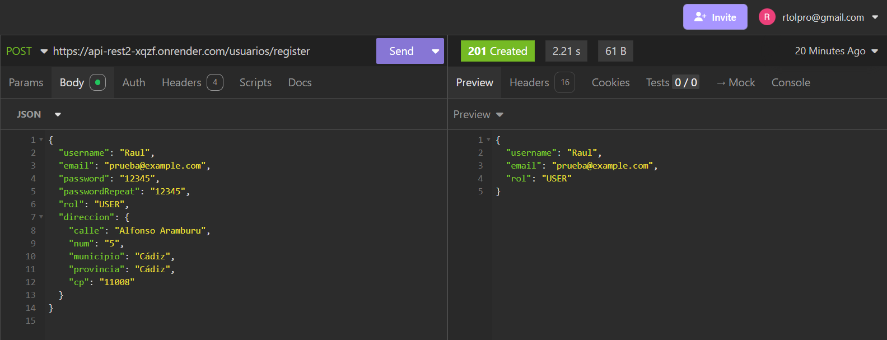
 
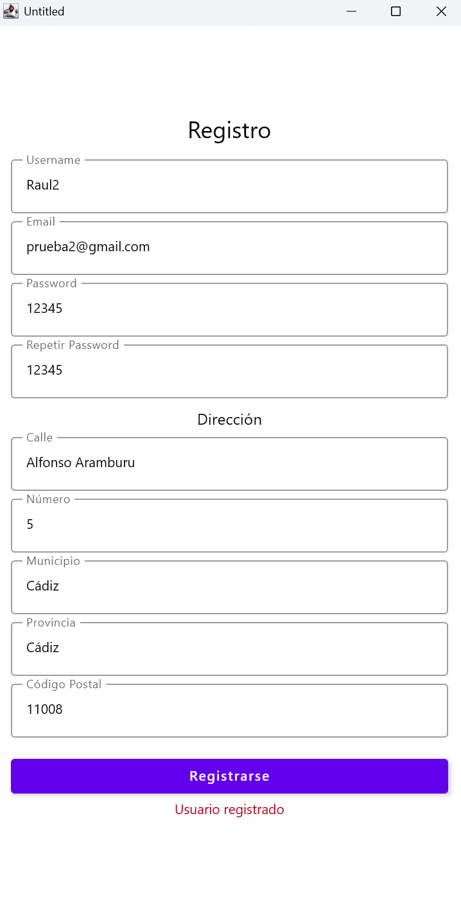
 
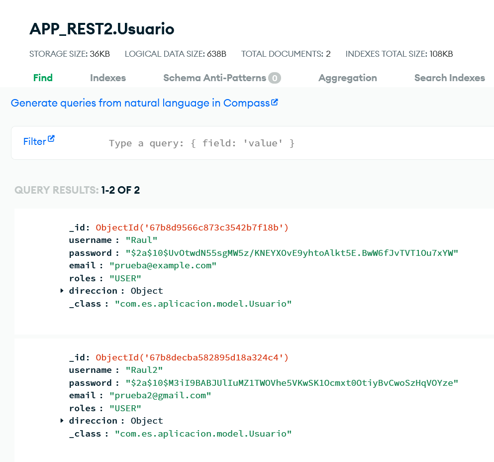

### Registrar un Usuario Admin

- En este caso vamos a registrar un usuario de tipo admin y vamos a realizar capturas tanto de insomnia como de la interfaz.

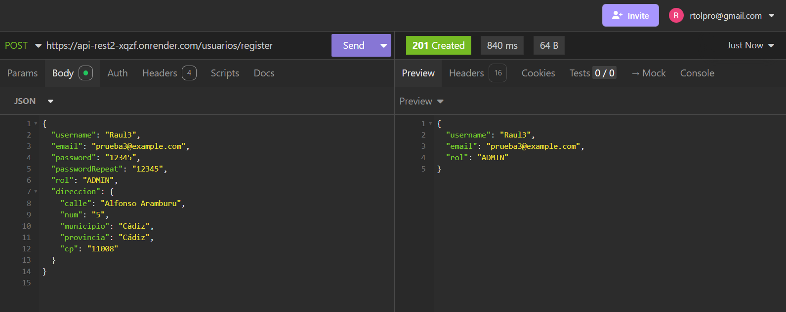
 
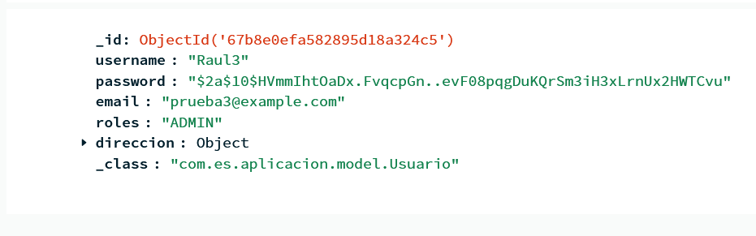
 

### Logear con un Usuario User

- En este caso vamos a logearnos con un usuario USER.

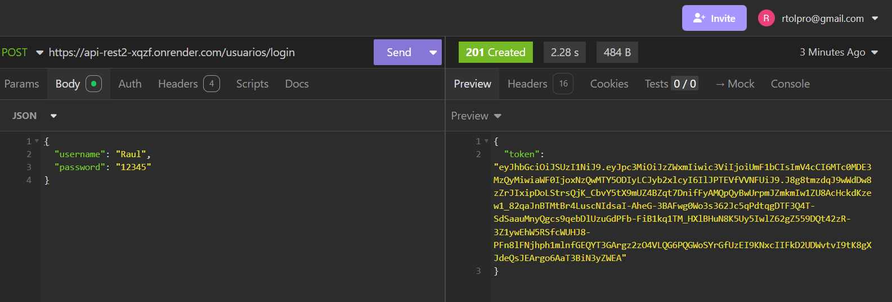
 
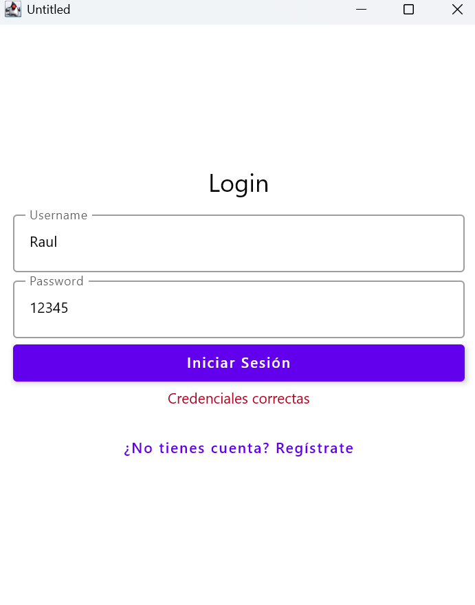
 

### Logear con un Usuario Admin

- En este caso vamos a logearnos con un usuario ADMIN.

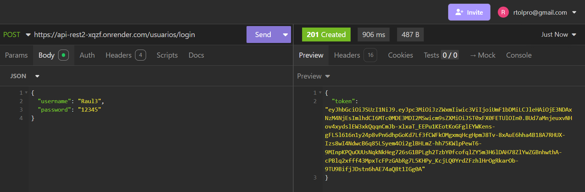
 
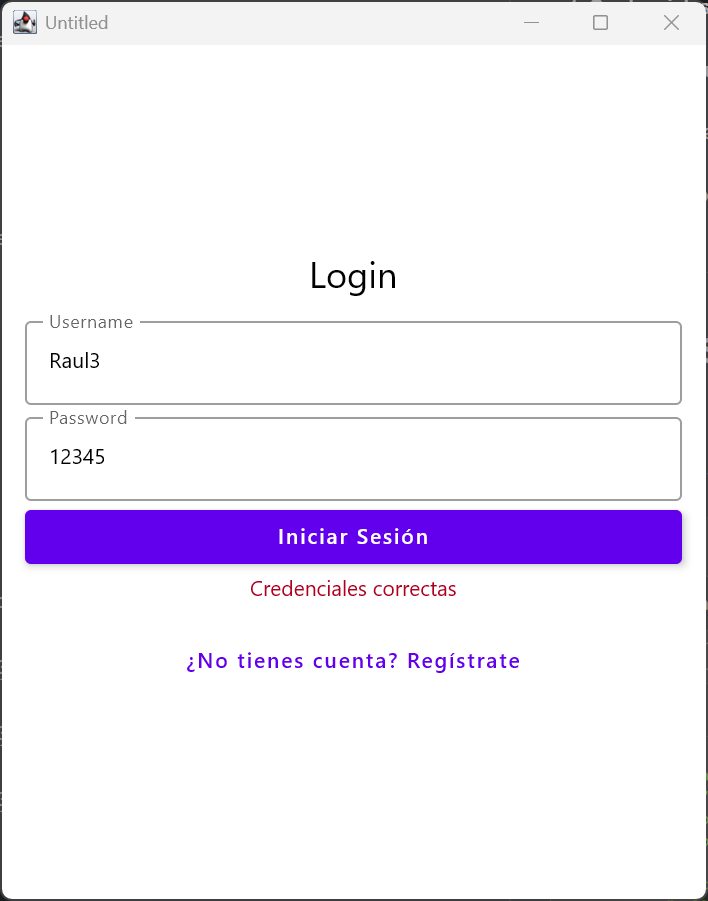
 

### Registrar un Usuario con campos incompletos

- Vamos a intentar realizar un registro erróneo con campos incompletos.

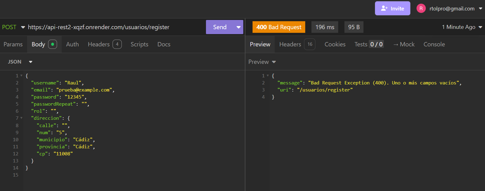
 
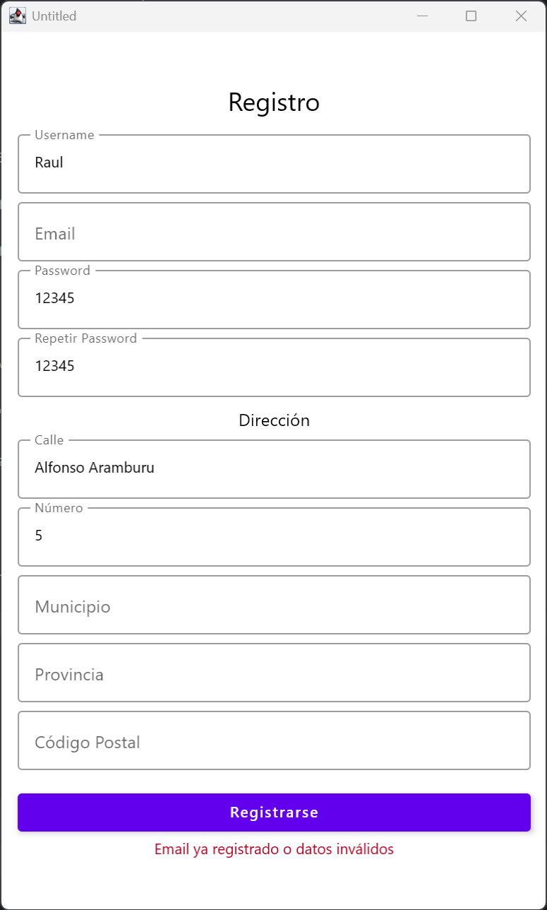
 

### Logear a un Usuario con datos incorrectos

- Vamos a intentar logearnos con un Usuario que sea incorrecto.

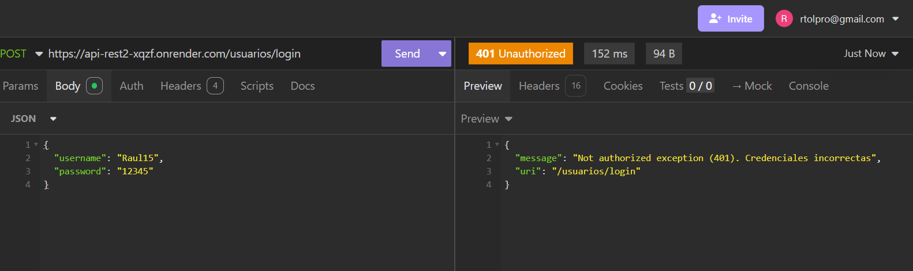
 
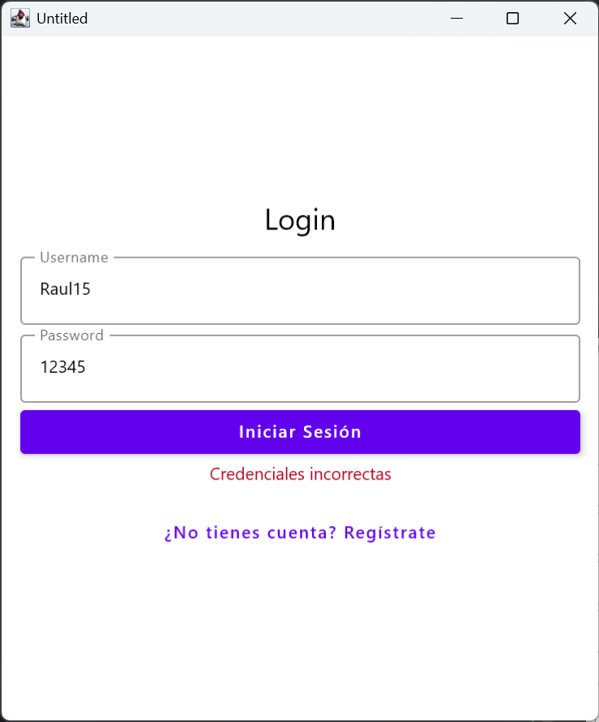
 

## PRUEBAS GESTIÓN TAREAS

### Generar usuarios USER y ADMIN para las pruebas

- En primer lugar vamos a empezar por crear un usuario que sea USER y otro que sea ADMI.

User:

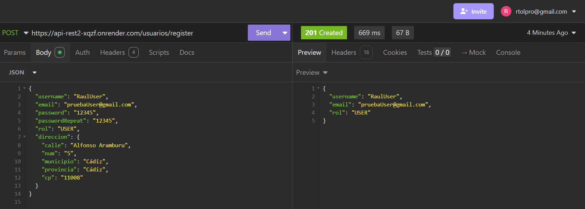

Admin:

### Crear una tarea propia como USER y como ADMIN

- Vamos a crear una tarea para el propio usuario logeado, cosa que se debería poder hacer con ambos tipos de usuario.

User:
Admin:

### Crear una tarea para otro usuario como USER y como ADMIN

- Vamos a crear una tarea para otro usuario, cosa que solo se debería poder hacer como admin.

User:
Admin:

### Eliminar una tarea propia como USER y como ADMIN

- Vamos a eliminar una tarea para el propio usuario logeado, cosa que se debería poder hacer con ambos tipos de usuario.

User:
Admin:

### Eliminar una tarea de otro usuario como USER y como ADMIN

- Vamos a eliminar una tarea asignada a otro usuario, cosa que solo se debería poder hacer como admin.

User:
Admin:

### Ver tareas como USER y como ADMIN

- Vamos ahora a pedir la lista de tareas disponibles, cosa que como USER solo debería mostrar las propias y como admin
debería mostrarte todas de todos los usuarios.

### Marcar una tarea como hecha por un USER

- Ahora vamos a marcar una tarea propia como completada, cosa que tienen que poder hacer los usuarios.
